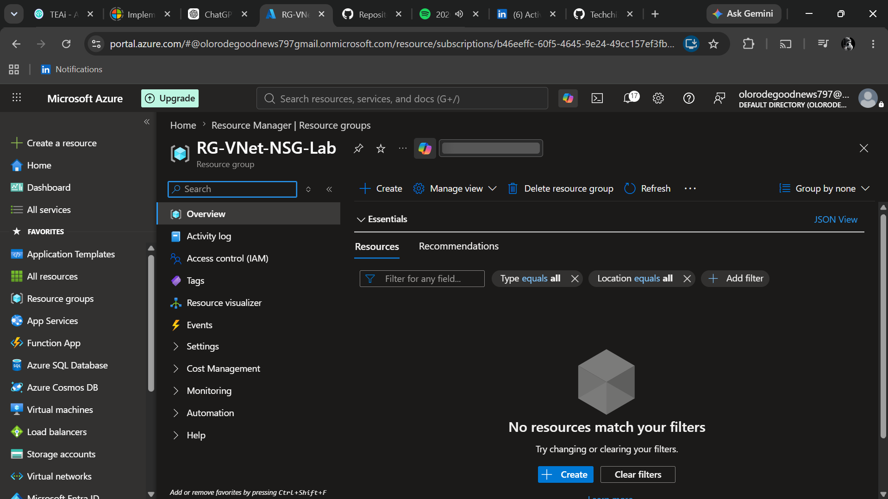
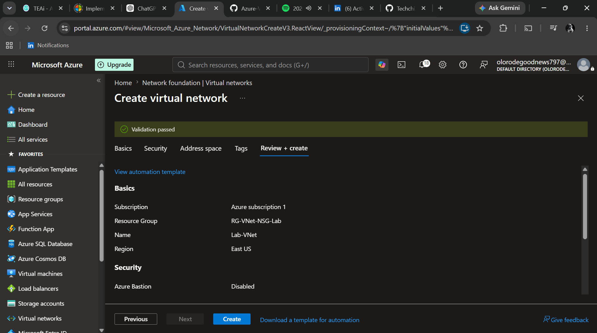
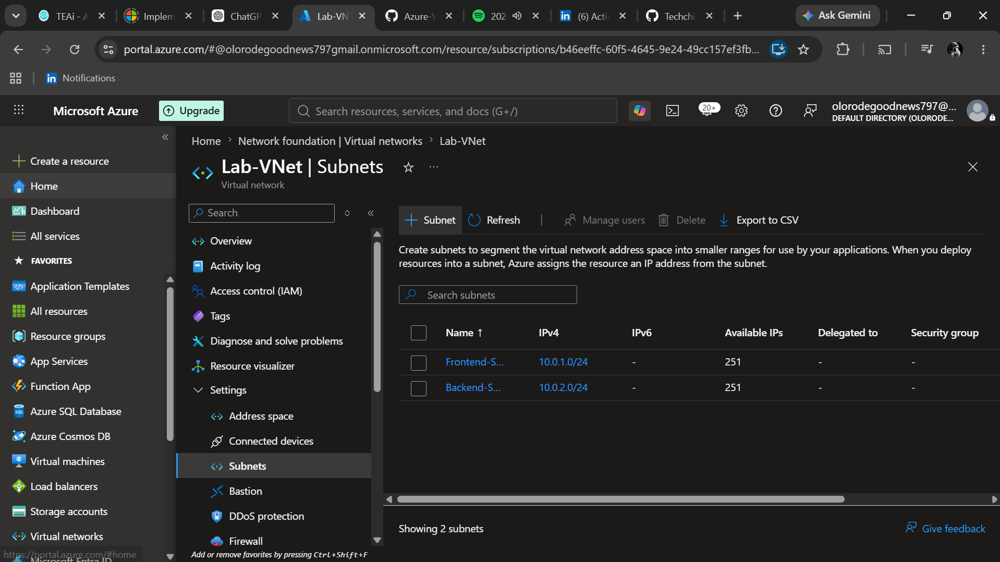

# Azure-Virtual-Network-Network-Security-Group-Lab

# Azure Virtual Network & Network Security Group Lab

## Project Overview

This project demonstrates how to build a secure Azure network by creating a Virtual Network (VNet), multiple subnets, Network Security Groups (NSGs), and Ubuntu Virtual Machines. It also includes connectivity testing and security rule validation.

---

## Step 1: Create a Resource Group

### Objective

Create a Resource Group to logically organize all Azure resources used in this lab.

### Configuration

| Setting | Value |
|----------|-------|
| Resource Group | RG-VNet-NSG-Lab |
| Region | East US |

### Why this step?

A Resource Group is a logical container that keeps all related Azure resources together. This makes it easier to manage, monitor, and delete the entire project when the lab is complete.

### Screenshot

---

## Step 2: Create the Virtual Network (VNet)

### Objective

Create a Virtual Network (VNet) that provides private networking for Azure resources in this lab.

### Configuration

| Setting | Value |
|----------|-------|
| Virtual Network | Lab-VNet |
| Address Space | 10.0.0.0/16 |
| Resource Group | RG-VNet-NSG-Lab |
| Region | East US |

### Why this step?

A Virtual Network creates an isolated network in Azure where resources such as virtual machines can securely communicate with each other.

### Screenshot

---

## Step 3: Create the Backend Subnet

### Objective

Create a second subnet inside the Virtual Network to separate backend resources from frontend resources.

### Configuration

| Setting | Value |
|----------|-------|
| Virtual Network | Lab-VNet |
| Subnet Name | Backend-Subnet |
| Address Range | 10.0.2.0/24 |

### Why this step?

Using separate subnets improves network organization and security. It allows different Network Security Group (NSG) rules to be applied to frontend and backend resources independently.

### Screenshot

